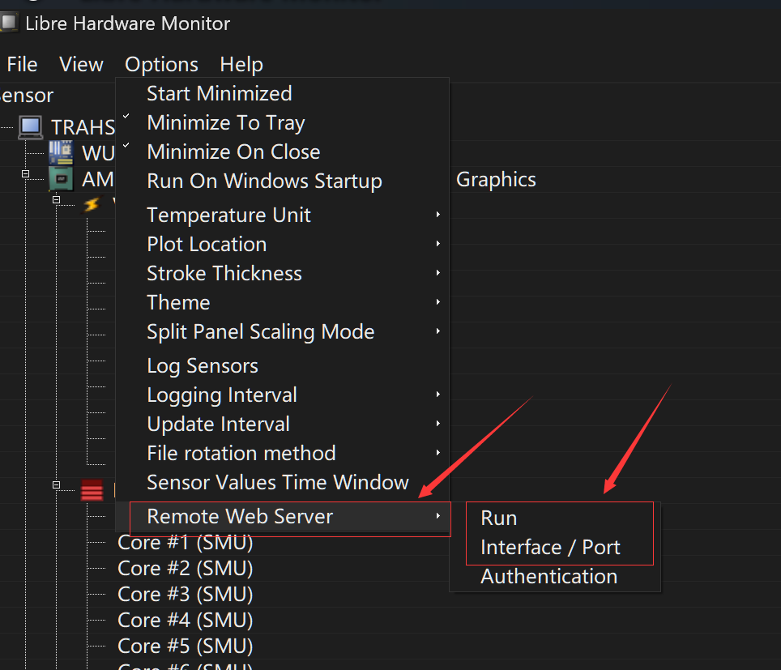
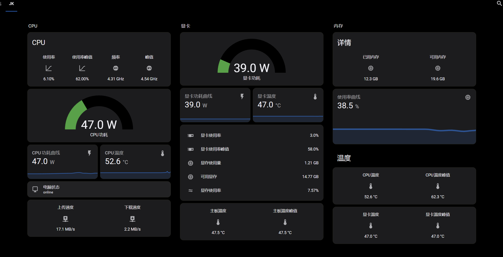

# pc_monitor_ha（Home Assistant 电脑监控）

[英文版](README_en.md)

不清楚现在有没有现成的项目，反正自己研究一个吧，仅提供一个思路，不通用，如果有更好的改进版本，我很乐意使用！（非专业码农）

- [LibreHardwareMonitor](https://github.com/LibreHardwareMonitor/LibreHardwareMonitor)
- emqx（mqtt服务器）
- 能跑python的局域网设备

aida64也可以实现，但我觉得太臃肿了，不够轻量化，于是找到了LibreHardwareMonitor这个软件，很轻量化，而且开源免费，数据覆盖面很全，也有用过OpenHardwareMonitor，功能倒是差不多，不过最后还是放弃，因为监测不到显卡。

软件可以开放一个web页面，然后获取json数据。

开了后就可以用python异步获取json数据，格式化清理获取到的数据，然后mqtt发送给自建的emqx（mqtt服务器），再在ha中添加mqtt就可以了。

效果图如下：

卡片这些就需要自定义了，数据我也选择了我需要用的部分，有需要的可以自己更改调整代码，不会的话，可以复制给AI，，，

