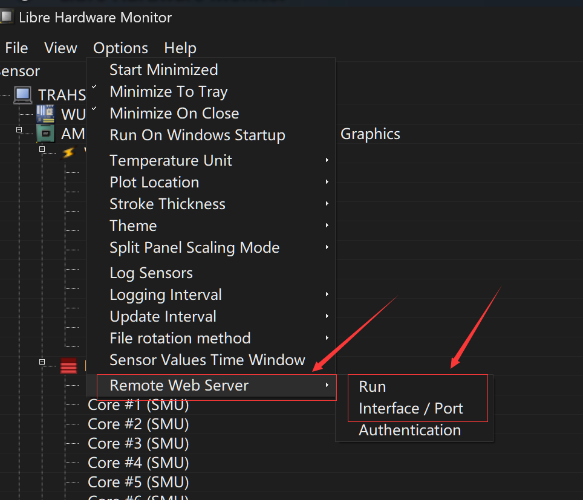
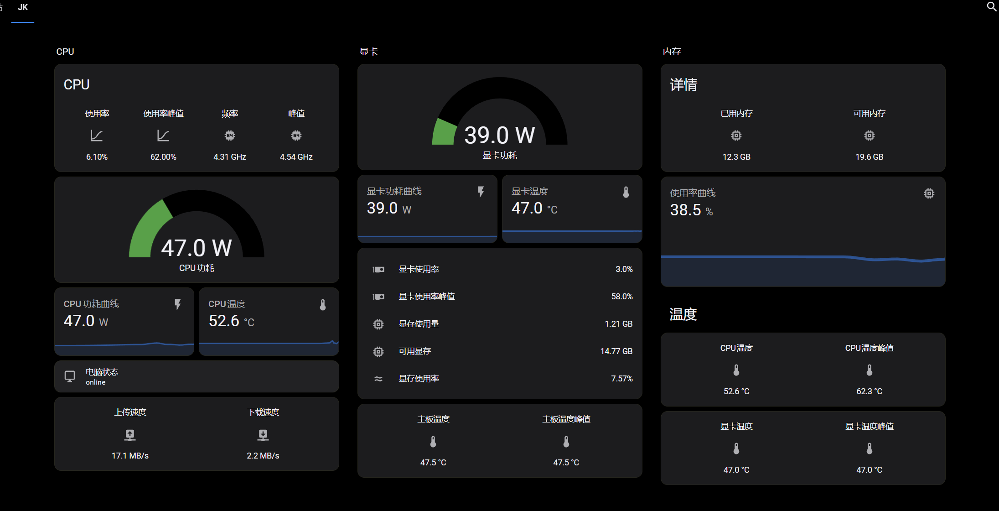

# pc_monitor_ha (Home Assistant PC Monitor)

I'm not sure if there are existing projects like this already, but I decided to work on one myself. This is just one possible approach and may not be universally applicable. If you have any better or improved versions, I'd be happy to use them! (Not a professional programmer)

- [LibreHardwareMonitor](https://github.com/LibreHardwareMonitor/LibreHardwareMonitor)
- EMQX (MQTT broker)
- A local network device that can run Python

AIDA64 can also achieve similar functionality, but I found it too heavy. I wanted something more lightweight, so I went with LibreHardwareMonitor — it's lightweight, open-source, and free, with comprehensive hardware data coverage. I also tried OpenHardwareMonitor, which offers similar functionality, but eventually gave it up because it couldn't monitor the GPU.

The software can expose a web page from which you can retrieve JSON data.

Once enabled, you can use Python to asynchronously fetch the JSON data, format and clean it up, then publish it via MQTT to your self-hosted EMQX (MQTT broker). Finally, just add the MQTT integration in Home Assistant.

Here's the final result:

You'll need to customize the cards in Home Assistant. I only selected the data I needed — feel free to modify the code to suit your own needs. If you're not sure how to do it, just copy the code and ask an AI for help ,,,,
